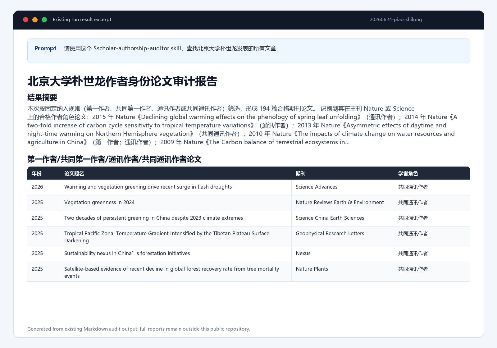
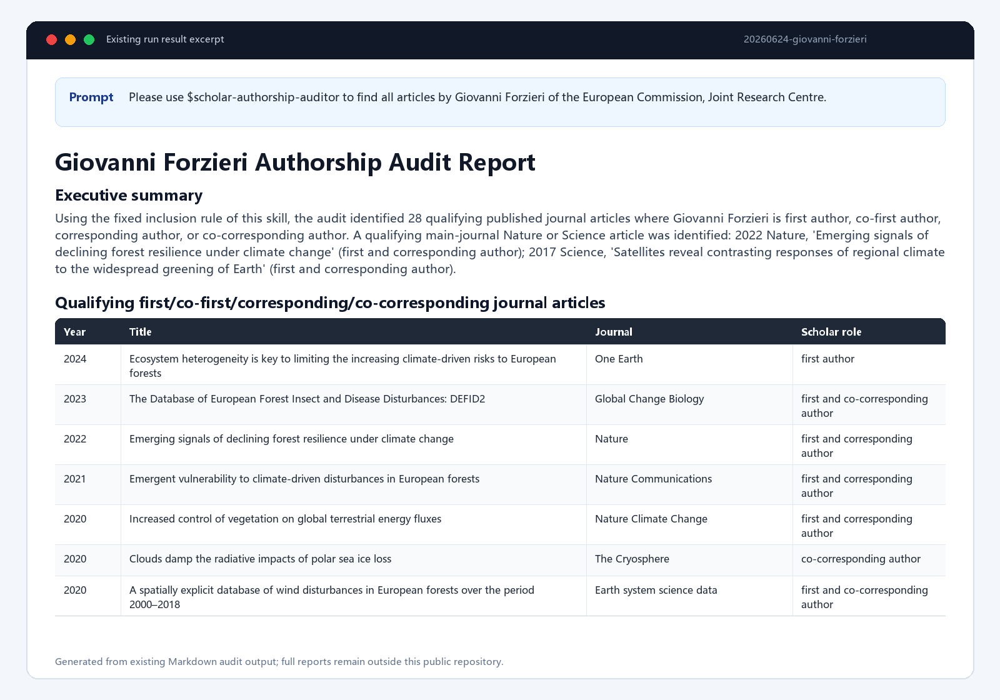

# Scholar Authorship Auditor for Codex


[English](README.md) | [简体中文](README_zh.md)

`scholar-authorship-auditor` 是一个用于学者署名论文审计的 Codex skill。它会重建目标学者的教育与任职时间线，处理同名作者混淆，并查找该学者作为第一作者、共同第一作者、通讯作者或共同通讯作者的论文。

在这个 skill 中，用户说“所有文章”“所有论文”“全部发表文章”时，默认指所有满足上述署名规则的论文。普通中间作者论文默认不纳入最终结果。

## 安装

让 Codex 帮你安装即可。给 Codex 发送这句话：

```text
请给我安装 [lwq-star/scholar-authorship-auditor](https://github.com/lwq-star/scholar-authorship-auditor) skill。
```

安装完成后，开启一个新的 Codex 聊天，让 skill 索引刷新。

## 快速开始

```text
请使用这个 [$scholar-authorship-auditor](SKILL.md) skill，查找北京大学朴世龙发表的所有文章。
```

```text
Please use this [$scholar-authorship-auditor](SKILL.md) skill to find all articles published by Giovanni Forzieri of the European Commission, Joint Research Centre.
```

聊天回答和生成报告会跟随用户提问语言。论文题名、期刊名、作者名、DOI、PMID、arXiv ID 和来源原文默认保留原文，除非用户明确要求翻译。

### 真实运行结果预览

下图由已有 Markdown 审计报告摘录生成；完整运行结果仍保留在公开仓库之外。





## 它能做什么

- 重建目标学者的教育和任职时间线。
- 结合机构、合作者、研究主题、标识符和官方主页处理同名作者混淆。
- 优先使用 OpenAlex 批量枚举；网页或 PDF 只用于核验模糊边界案例。
- 生成紧凑论文表：`年份 | 题名 | 期刊 | 学者角色`。
- 输出 Markdown 和 Word 报告。

## 默认纳入范围

默认纳入：

- 第一作者论文；
- 有明确共同贡献证据的共同第一作者论文；
- 有数据库、文章页面、PDF 或出版商证据的通讯作者论文；
- 有明确证据的共同通讯作者论文。

默认排除：

- 仅为普通中间作者的论文；
- 没有通讯作者证据的最后作者论文；
- 专利、数据集、学位论文、新闻、社论、更正、海报和联盟作者记录；
- 无法解决同名作者冲突的记录。

## 输出

完整运行默认生成：

```text
<scholar-name>-authorship-audit-report.md
<scholar-name>-authorship-audit-report.docx
```

默认输出位置：

```text
<当前工作目录>/outputs/scholar-authorship-auditor/<YYYYMMDD>-<scholar-name-slug>/
```

## 仓库内容

```text
scholar-authorship-auditor/
  SKILL.md
  references/
  scripts/render_report.py
  assets/authorship-audit-template.docx
```

## 可选 OpenAlex API Key

这个 skill 使用 OpenAlex API key 时效果更好。你可以花大约 30 秒在 OpenAlex 平台注册一个免费账户，并获得一个免费的 API key。之后在 Codex 使用这个 skill 时，把这个 API key 告知 Codex，或通过安全的 secret 渠道提供即可。

本 skill 不会将你的 API key 公布到网上。不要把 API key 硬编码进 `SKILL.md`、脚本、README、报告、日志或公开的 GitHub commit。
